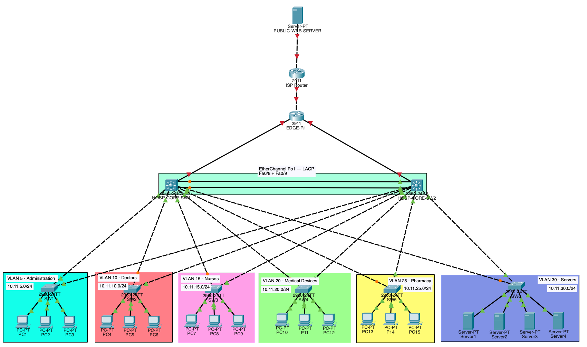

# Hospital Network Lab

> **Status: Work in Progress**
>
> This project is in active development. The current repository includes VLAN segmentation, IP addressing, dual core switches and EtherChannel redundancy. Additional routing, security, monitoring and network services will be added as the lab progresses.

A Cisco Packet Tracer hospital network designed to demonstrate VLAN segmentation, Layer 3 routing, subnetting, IP addressing, redundancy and enterprise network planning.

## Network Overview

The network separates hospital departments into dedicated VLANs:

| VLAN | Department      | Subnet        | Gateway    |
| ---- | --------------- | ------------- | ---------- |
| 5    | Administration  | 10.11.5.0/24  | 10.11.5.1  |
| 10   | Doctors         | 10.11.10.0/24 | 10.11.10.1 |
| 15   | Nurses          | 10.11.15.0/24 | 10.11.15.1 |
| 20   | Medical Devices | 10.11.20.0/24 | 10.11.20.1 |
| 25   | Pharmacy        | 10.11.25.0/24 | 10.11.25.1 |
| 30   | Servers         | 10.11.30.0/24 | 10.11.30.1 |

## Architecture

- Dual Cisco multilayer core switches
- Six departmental VLANs
- Dedicated access switches
- Inter-VLAN routing
- Hospital edge router
- ISP router and simulated public network
- Internal server VLAN
- External public web server
- Point-to-point WAN links
- Redundant core-switch connectivity using EtherChannel

## Logical Topology


## VLAN and IP Addressing Plan


## Network Upgrades

### EtherChannel (LACP)

Two physical FastEthernet links between `HOSP-CORE-SW1` and `HOSP-CORE-SW2` are bundled into one logical Port-Channel using LACP.



#### Configuration

- Interfaces: `Fa0/8` and `Fa0/9`
- Logical interface: `Port-Channel 1`
- Negotiation protocol: LACP
- LACP mode: Active

#### Benefits

- 200 Mbps aggregate capacity across two 100 Mbps links
- Link redundancy if one physical connection fails
- Load balancing across network flows
- One logical connection from the perspective of Spanning Tree Protocol

#### Verification

```text
1      Po1(SU)           LACP   Fa0/8(P) Fa0/9(P)
```

- `S` — Layer 2 EtherChannel
- `U` — Port-Channel is in use
- `P` — Interface successfully bundled

## Repository Contents

```text
hospital-network-lab/
├── diagrams/
│   ├── hospital-network-logical-topology.png
│   ├── hospital-network-vlan-ip-plan.png
│   └── etherchannel-lacp.png
├── hospital.pkt
├── .gitignore
└── README.md
```
