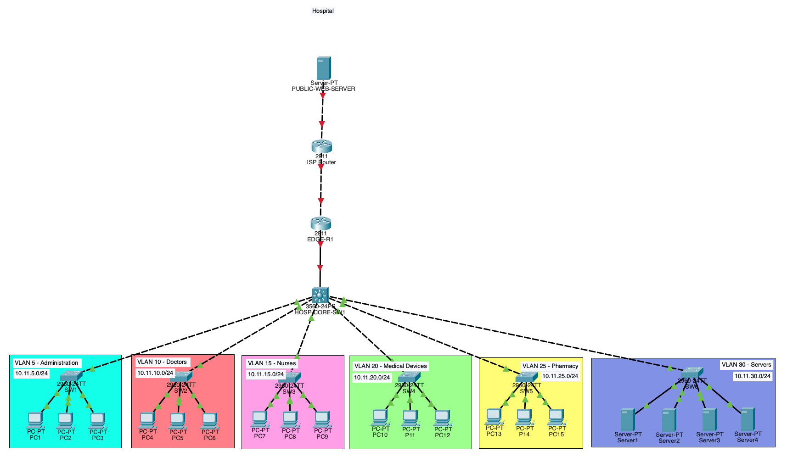

# Hospital Network Lab

> **Status: Work in Progress**
>
> This project is in active development. The current repository contains the initial topology, VLAN structure and IP addressing plan. Routing, security controls, redundancy, network services, testing and documentation will be added as the lab progresses.

A Cisco Packet Tracer hospital network designed to demonstrate VLAN segmentation, Layer 3 routing, subnetting, IP addressing and enterprise network planning.

A Cisco Packet Tracer hospital network designed to demonstrate VLAN segmentation, Layer 3 routing, subnetting, IP addressing and enterprise network planning.

## Network Overview

The network separates hospital departments into dedicated VLANs:

| VLAN | Department | Subnet | Gateway |
|---|---|---|---|
| 5 | Administration | 10.11.5.0/24 | 10.11.5.1 |
| 10 | Doctors | 10.11.10.0/24 | 10.11.10.1 |
| 15 | Nurses | 10.11.15.0/24 | 10.11.15.1 |
| 20 | Medical Devices | 10.11.20.0/24 | 10.11.20.1 |
| 25 | Pharmacy | 10.11.25.0/24 | 10.11.25.1 |
| 30 | Servers | 10.11.30.0/24 | 10.11.30.1 |

## Architecture

- Cisco multilayer core switch
- Six departmental VLANs
- Dedicated access switches
- Inter-VLAN routing
- Hospital edge router
- ISP router and simulated public network
- Internal server VLAN
- External public web server
- Point-to-point WAN links

## Logical Topology



## VLAN and IP Addressing Plan


## Repository Contents

```text
hospital-network-lab/
├── diagrams/
│   ├── hospital-network-logical-topology.png
│   └── hospital-network-vlan-ip-plan.png
├── hospital.pkt
├── Hospital Network Planning.key
└── README.md
