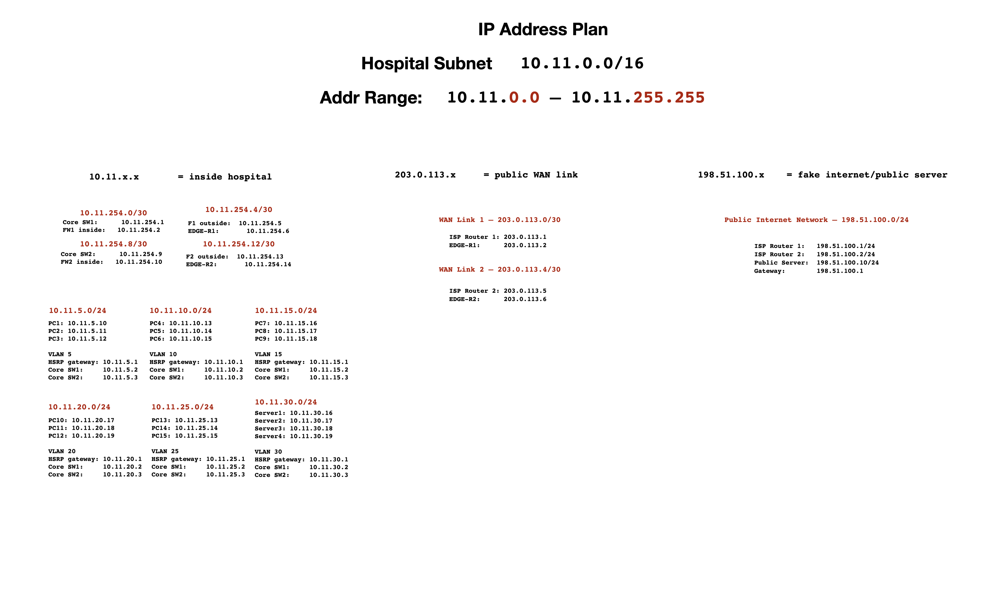
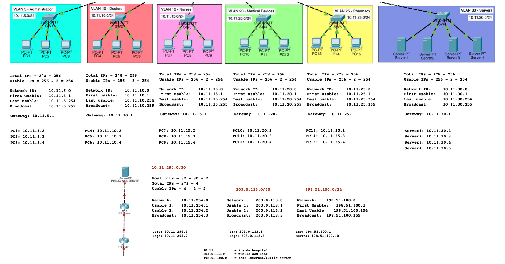
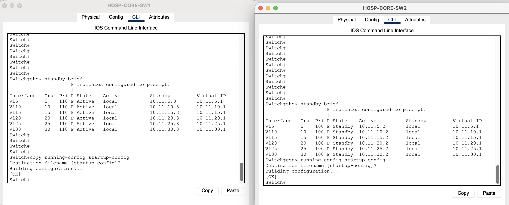

# Hospital Network Lab

> **Status: Active Development — Core networking, routing, redundancy and initial security controls implemented**

A Cisco Packet Tracer hospital network demonstrating VLAN segmentation, Layer 3 switching, subnetting and IP addressing, LACP EtherChannel, HSRP gateway redundancy, dual firewall, edge-router and ISP paths, static/default/return routing, ASA ICMP inspection, extended ACLs, access-switch port security, and failover and end-to-end connectivity testing.

## Implemented Upgrades

### 🔁 Redundancy

| Feature | Status | Purpose |
| --- | --- | --- |
| EtherChannel using LACP | ✅ Implemented | Bundles core links for additional bandwidth and link redundancy. |
| HSRP Gateway Redundancy | ✅ Implemented and tested | Provides automatic default-gateway failover across all VLANs. |
| Dual WAN and Perimeter Paths | 🟡 Partially validated | Provides redundant firewall, edge-router and ISP paths. |

> Full public-side failover remains in development because the public web server currently uses ISP-R1 as its single default gateway.

### 🧭 Routing and Connectivity

| Feature | Status | Purpose |
| --- | --- | --- |
| Static, Default and Return Routing | ✅ Implemented | Provides end-to-end connectivity between hospital and public networks. |
| ASA ICMP Inspection | ✅ Implemented | Allows stateful handling of ICMP requests and replies. |
| Full IP Addressing Plan | ✅ Documented | Maps VLAN, transit, WAN and public-network addressing. |
| eBGP External Routing | 🟡 In progress | Exchanges routes between the hospital edge routers and simulated ISP autonomous systems. |
| OSPF Internal Routing | 🟠 Planned | Will provide dynamic route learning inside the hospital network. |

### 🔐 Security

| Feature | Status | Purpose |
| --- | --- | --- |
| Extended ACLs | ✅ Implemented and tested | Restricts communication between selected hospital VLANs. |
| Switch Port Security | ✅ Implemented and tested | Restricts access ports to authorised MAC addresses. |
| DHCP Snooping | ⚪ Deferred | Deferred until DHCP addressing is deployed. |

### 🚑 Performance

| Feature | Status | Purpose |
| --- | --- | --- |
| Quality of Service | 🟠 Planned | Prioritise VoIP, emergency and critical medical traffic. |

## Network Architecture

- Two Cisco multilayer core switches providing inter-VLAN routing
- Six departmental VLANs with dedicated access switches
- LACP EtherChannel between the core switches
- HSRP virtual default gateways for every VLAN
- Two Cisco ASA firewalls, hospital edge routers and simulated ISP routers
- Internal server VLAN and an external public web server
- `/30` point-to-point transit and WAN networks
- Static, default and return routing
- Stateful ASA ICMP inspection and extended inter-VLAN ACLs
- Sticky-MAC access-switch port security

## Logical Topology


## IP Addressing Plan



## VLAN and IP Addressing Plan



### VLAN Networks

| VLAN | Department | Subnet | HSRP Gateway | Core SW1 | Core SW2 |
| --- | --- | --- | --- | --- | --- |
| 5 | Administration | `10.11.5.0/24` | `10.11.5.1` | `10.11.5.2` | `10.11.5.3` |
| 10 | Doctors | `10.11.10.0/24` | `10.11.10.1` | `10.11.10.2` | `10.11.10.3` |
| 15 | Nurses | `10.11.15.0/24` | `10.11.15.1` | `10.11.15.2` | `10.11.15.3` |
| 20 | Medical Devices | `10.11.20.0/24` | `10.11.20.1` | `10.11.20.2` | `10.11.20.3` |
| 25 | Pharmacy | `10.11.25.0/24` | `10.11.25.1` | `10.11.25.2` | `10.11.25.3` |
| 30 | Servers | `10.11.30.0/24` | `10.11.30.1` | `10.11.30.2` | `10.11.30.3` |

### Internal Transit Networks

| Link | Subnet | Device 1 | Device 2 |
| --- | --- | --- | --- |
| Core SW1 ↔ FW1 inside | `10.11.254.0/30` | Core SW1: `10.11.254.1` | FW1 inside: `10.11.254.2` |
| FW1 outside ↔ EDGE-R1 | `10.11.254.4/30` | FW1 outside: `10.11.254.5` | EDGE-R1: `10.11.254.6` |
| Core SW2 ↔ FW2 inside | `10.11.254.8/30` | Core SW2: `10.11.254.9` | FW2 inside: `10.11.254.10` |
| FW2 outside ↔ EDGE-R2 | `10.11.254.12/30` | FW2 outside: `10.11.254.13` | EDGE-R2: `10.11.254.14` |

### WAN Networks

| Link | Subnet | ISP Router | Hospital Edge Router |
| --- | --- | --- | --- |
| WAN Link 1 | `203.0.113.0/30` | ISP-R1: `203.0.113.1` | EDGE-R1: `203.0.113.2` |
| WAN Link 2 | `203.0.113.4/30` | ISP-R2: `203.0.113.5` | EDGE-R2: `203.0.113.6` |

### Simulated Public Network

| Device | Address |
| --- | --- |
| ISP-R1 public interface | `198.51.100.1/24` |
| ISP-R2 public interface | `198.51.100.2/24` |
| Public web server | `198.51.100.10/24` |
| Public web server default gateway | `198.51.100.1` |

## Network Upgrades

### EtherChannel using LACP

Two FastEthernet links between `HOSP-CORE-SW1` and `HOSP-CORE-SW2` are bundled into `Port-Channel 1` to provide 200 Mbps of aggregate capacity, load balancing and link redundancy.

- Interfaces: `Fa0/8` and `Fa0/9`
- Negotiation protocol: LACP
- Port-channel: `Po1`

Concise verification output:

```text
1      Po1(SU)           LACP   Fa0/8(P) Fa0/9(P)
```

`S` identifies a Layer 2 EtherChannel, `U` shows that the port-channel is operational and `P` confirms that each physical interface is bundled.

### HSRP Gateway Redundancy

HSRP supplies a stable `.1` virtual default gateway for each departmental VLAN. Core SW1 normally has priority `110` and operates as Active; Core SW2 has priority `100` and operates as Standby. Preemption is configured so Core SW1 can reclaim the Active role after it recovers.



Failover was tested by making Core SW1 unavailable. Core SW2 successfully became Active for VLANs 5, 10, 15, 20, 25 and 30. The PCs continued using their existing `.1` virtual gateways and did not require a gateway change.

> **Limitation:** HSRP gateway failover worked internally, but end-to-end public-server connectivity did not fully survive the Core SW1 failure because the public server still uses ISP-R1 at `198.51.100.1` as its single default gateway. Public-side gateway redundancy using HSRP and potentially IP SLA/object tracking remains planned.

### Dual WAN and Perimeter Paths

The design contains two separate perimeter paths:

```text
Core SW1 → FW1 → EDGE-R1 → ISP-R1
Core SW2 → FW2 → EDGE-R2 → ISP-R2
```

Both paths are addressed and participate in normal-state routing. The second firewall, edge-router and ISP path provides the foundation for redundancy, but complete public-side failover has not yet been validated because the public server has only one default gateway.

### Static, Default and Return Routing

End-to-end Layer 3 communication requires every device on the forward path to have a matching route toward the destination. The reverse path must also contain routes back toward the original source; successful one-way forwarding alone is not sufficient.

The general forward path is:

```text
Hospital PC
→ HSRP virtual gateway
→ multilayer core switch
→ ASA firewall
→ edge router
→ ISP router
→ public web server
```

- Core switches use default routes toward their local firewalls.
- Firewalls use default routes toward their edge routers.
- Edge routers use default routes toward their ISP routers.
- Firewalls, edge routers and ISP routers use routes toward the summarised hospital network `10.11.0.0/16`.
- More-specific routes take priority over default routes.
- The topology was troubleshot one Layer 3 hop at a time in both directions.

This work demonstrates directly connected routes, static routes, default routes, return routes, next-hop reachability, route summarisation, administrative distance, forward-path troubleshooting, return-path troubleshooting and asymmetric routing.

## 🌍 Dynamic Routing Development

The hospital network is being expanded from static routing toward a hybrid dynamic-routing design.

- OSPF will handle internal route exchange within the hospital network.
- eBGP will handle route exchange between the hospital edge routers and simulated ISP routers.
- Static routes will remain in place during migration and testing.
- Existing HSRP, ACL, ASA firewall and port-security configurations will remain unchanged.

```text
Hospital internal routing → OSPF
Hospital edge to ISP routing → eBGP
```

Autonomous systems:

- Hospital network: `AS 65010`
- ISP Router 1: `AS 65001`
- ISP Router 2: `AS 65002`

### eBGP Progress

Current progress:

- `EDGE-R1` is configured in `AS 65010`.
- `ISP-R1` is configured in `AS 65001`.
- The eBGP neighbour relationship between `203.0.113.2` and `203.0.113.1` has been established.
- `EDGE-R1` advertises the hospital summary route `10.11.0.0/16`.
- `ISP-R1` advertises the simulated public network `198.51.100.0/24`.
- BGP neighbour establishment and route exchange were verified using:
  - `show ip bgp summary`
  - `show ip bgp`
  - `show ip route bgp`

Remaining work:

- Configure eBGP between `EDGE-R2` and `ISP-R2`.
- Verify route exchange on the second ISP path.
- Test BGP path preference.
- Test dual-ISP failover.
- Document the final BGP routing tables.

### OSPF Progress

OSPF is currently being studied and prepared for implementation.

Planned scope:

- Advertise hospital VLAN and transit networks dynamically.
- Reduce reliance on internal static routes.
- Form OSPF neighbour relationships between internal Layer 3 devices.
- Verify learned OSPF routes.
- Test failover behaviour with the dual-core and dual-perimeter design.
- Keep eBGP at the ISP boundary while OSPF handles internal routing.

## Security Controls

### ASA ICMP Inspection

The following policy was applied on both ASA firewalls:

```cisco
policy-map global_policy
 class inspection_default
  inspect icmp
 exit
exit

service-policy global_policy global
```

ICMP inspection allows each firewall to track an ICMP request and permit the matching reply statefully. Enabling it on both firewalls helped distinguish route failures from firewall-policy failures during end-to-end testing.

### Extended ACLs

The ACL workflow used in the lab was:

1. Create or open a named extended ACL.
2. Add ordered permit and deny rules.
3. Apply the ACL to the appropriate Layer 3 interface and direction.

#### Pharmacy VLAN Policy

```cisco
ip access-list extended PHARMACY-IN
 deny ip 10.11.25.0 0.0.0.255 10.11.5.0 0.0.0.255
 permit ip any any
exit

interface vlan 25
 ip access-group PHARMACY-IN in
```

`PHARMACY-IN` blocks all IP traffic originating from Pharmacy VLAN 25 toward Administration VLAN 5 while permitting all other Pharmacy traffic. It is applied inbound on the VLAN 25 SVI and must exist on both core switches because either switch can become the HSRP Active gateway. The explicit `permit ip any any` is required because every ACL has an implicit deny at the end.

Validation results:

- Pharmacy PC → Administration PC: denied
- Pharmacy PC → public web server: permitted
- Deny and permit match counters increased as expected

#### Server VLAN Policy

```cisco
ip access-list extended SERVERS-IN
 deny ip 10.11.30.0 0.0.0.255 10.11.5.0 0.0.0.255
 permit ip any any
exit

interface vlan 30
 ip access-group SERVERS-IN in
```

`SERVERS-IN` blocks traffic originating from Server VLAN 30 toward Administration VLAN 5 while permitting other server traffic. It is applied inbound on the VLAN 30 SVI.

### Switch Port Security

Port security was configured and tested on a physical Pharmacy access-switch port, not on a core-switch SVI:

```cisco
interface fastethernet0/1
 switchport mode access
 switchport access vlan 25
 switchport port-security
 switchport port-security maximum 1
 switchport port-security mac-address sticky
 switchport port-security violation restrict
```

The port allows one MAC address, and sticky learning automatically records the connected device's MAC address. Restrict mode drops frames from unauthorised MAC addresses while keeping the port operational. Connecting a second device successfully produced one security violation.

Concise verification output:

```text
Port Security              : Enabled
Port Status                : Secure-up
Violation Mode             : Restrict
Maximum MAC Addresses      : 1
Total MAC Addresses        : 1
Sticky MAC Addresses       : 1
Security Violation Count   : 1
```

## Connectivity Validation

During the normal operating state, PCs 1 through 15 successfully reached the public web server. Testing also validated:

- Inter-VLAN routing
- HSRP virtual gateways
- Static, default and return routing
- ASA ICMP inspection
- ACL deny and permit behaviour
- Port-security restrict behaviour
- HSRP failover from Core SW1 to Core SW2

Full public-side failover remains incomplete due to the public web server's single default gateway.

## Troubleshooting Methodology

Validation followed a structured sequence:

```text
Physical connection
→ interface state
→ IP address and subnet
→ default gateway
→ forward route
→ next-hop reachability
→ return route
→ firewall or ACL policy
→ NAT if required
```

The last successful hop shows that connectivity works up to that point. The first failed hop identifies the device, link or policy boundary to investigate next.

The lab used `traceroute`, `ping`, `show ip interface brief`, `show ip route`, `show route`, `show standby brief`, `show access-lists` and `show port-security interface` during validation.

## Planned Enhancements

- Expand ACL policies across additional VLANs
- Deploy port security across remaining user access ports
- Add a dedicated Voice VLAN
- Add Cisco IP phones
- Implement QoS classification, marking and queueing
- Configure DHCP and DHCP relay
- Enable DHCP snooping after DHCP is deployed
- Add SSH-based management
- Add NTP
- Add central Syslog
- Add SNMP monitoring
- Add NAT for realistic private-to-public connectivity
- Add public-side gateway redundancy
- Add IP SLA and object tracking
- Perform complete firewall, edge-router and ISP failover testing
- Complete eBGP peering between `EDGE-R2` and `ISP-R2`
- Implement OSPF inside the hospital network
- Replace selected internal static routes only after OSPF is verified
- Configure BGP path preference
- Test BGP failover across both ISP paths
- Document OSPF neighbours, areas, LSAs and learned routes
- Add verification screenshots after both protocols are fully tested

## Topology Progress

- `v1.0` — Initial VLAN topology
- `v1.2` — Dual core switches and EtherChannel
- `v1.3` — HSRP gateway redundancy across all VLANs
- `v1.4` — Dual firewalls, edge routers, ISP links and interface addressing

## Configuration Milestones

- Static, default and return routing implemented
- ASA ICMP inspection implemented on both firewalls
- Normal-state public connectivity validated from PCs 1 through 15
- HSRP failover from Core SW1 to Core SW2 validated
- Extended ACLs implemented and tested
- Access-switch port security implemented and tested
- Full public-side failover remains incomplete
- ✅ eBGP peering between `EDGE-R1` and `ISP-R1` established
- ✅ Hospital and public routes exchanged through eBGP
- 🟡 Second eBGP ISP path still in progress
- 🟠 OSPF implementation planned and currently being studied
- 🟡 Full dual-path dynamic-routing validation not yet complete

## Repository Contents

```text
hospital-network-lab/
├── diagrams/
│   ├── Hospital Network Logical Topology v1.0.png
│   ├── Hospital Network Logical Topology v1.2.png
│   ├── Hospital Network Logical Topology v1.3.png
│   ├── Hospital Network Logical Topology v1.4.png
│   ├── hospital-network-ip-addressing-plan-v2.0.png
│   ├── hospital-network-vlan-ip-plan.png
│   └── hsrp-all-vlans-verification.png
├── hospital.pkt
├── .gitignore
└── README.md
```
